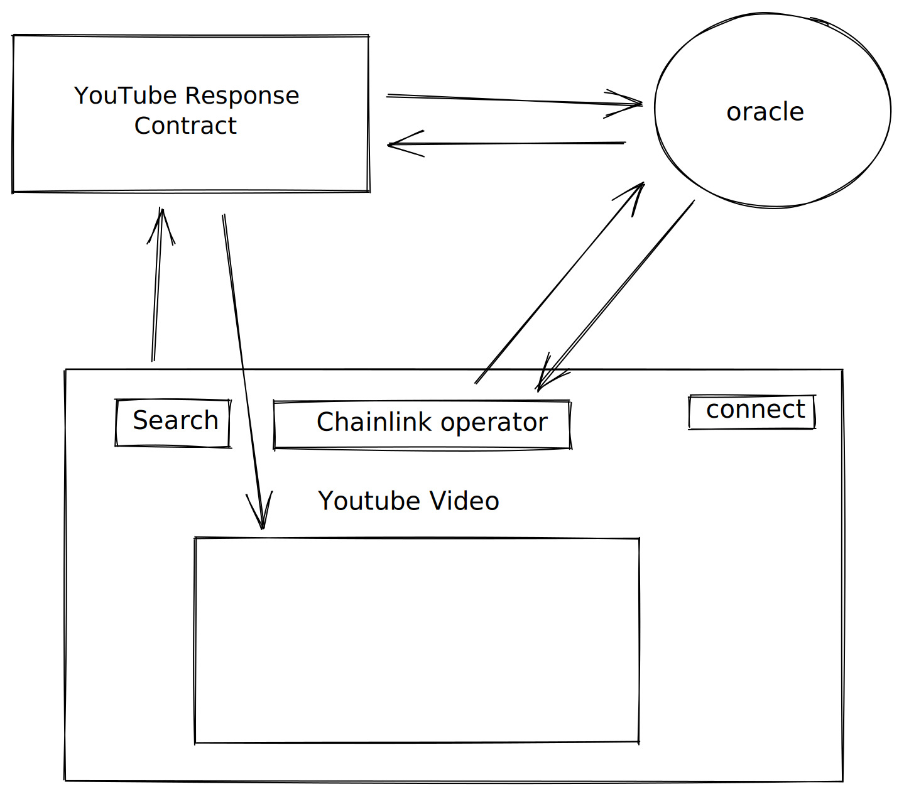

# web3 app

# Getting Started

Tnpm o run, clone the repo and npm install before starting the server:
```bash
npm install
npm run build
npm start
```

This project uses:
- Chainlink Nodes
- Quicknode Endpoint
- Google Cloud VM
<!-- 
# to upload files to ipfd using web3-storage w3up
$ npm install -g @web3-storage/w3up-cli 
$ w3up id && w3up register meek10x@gmail.com && w3up whoami && w3up list 
$ w3up upload ~/Desktop/portfolio_oct_2022.pdf 
 -->

